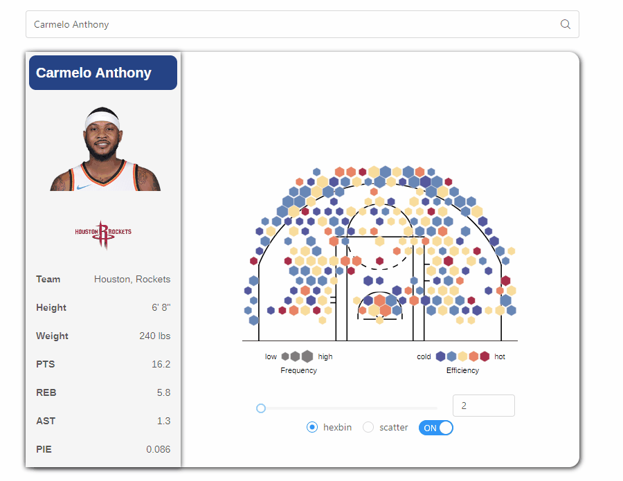
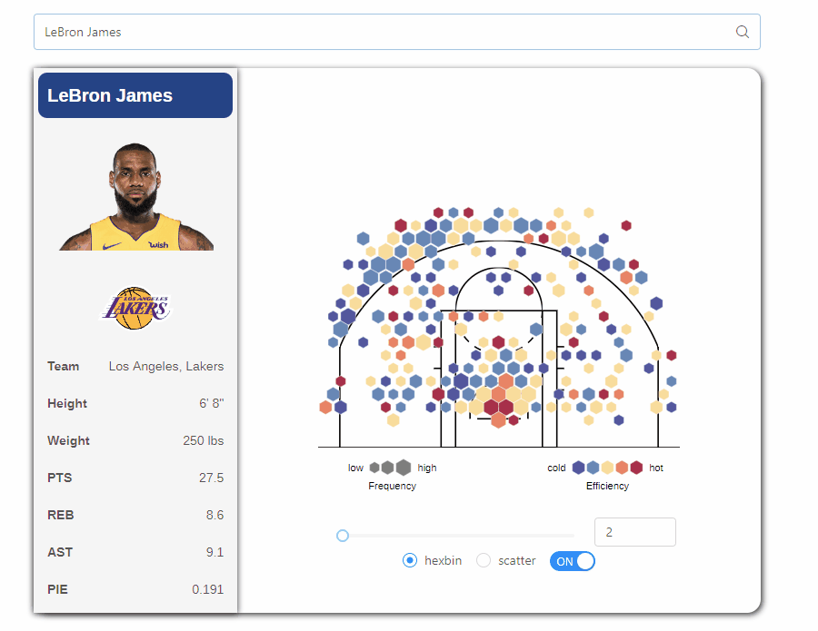
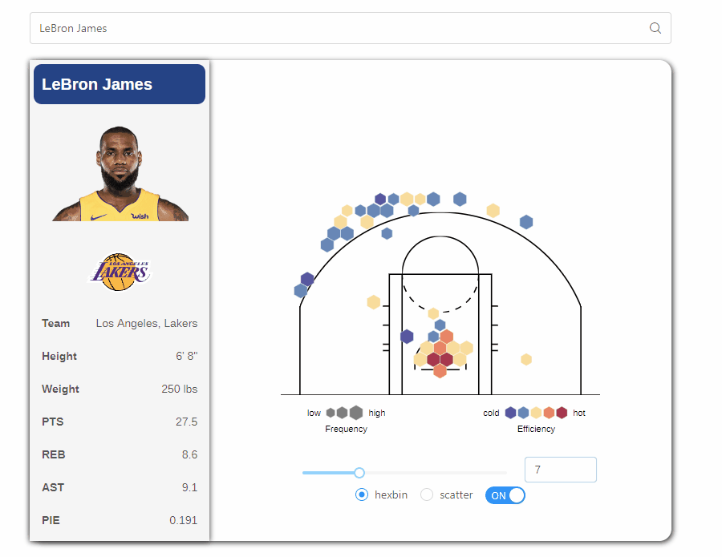

# Summary
Library: NBA, shotchart.

GitHub page: https://dinglezhang94.github.io/nba-web/

# Search Player

# Adjust the shot frequency filter

# Swap between cluster mode to scatter mode

# Turn on and off the modal

